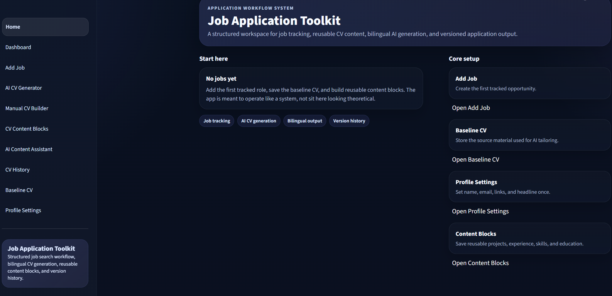
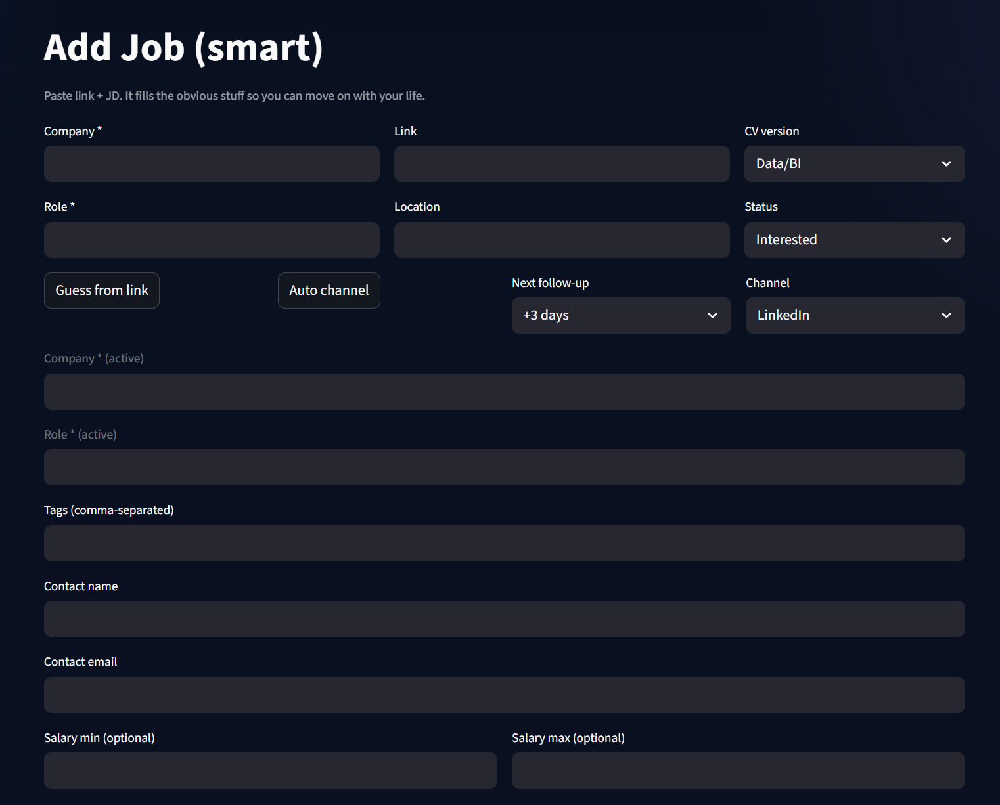
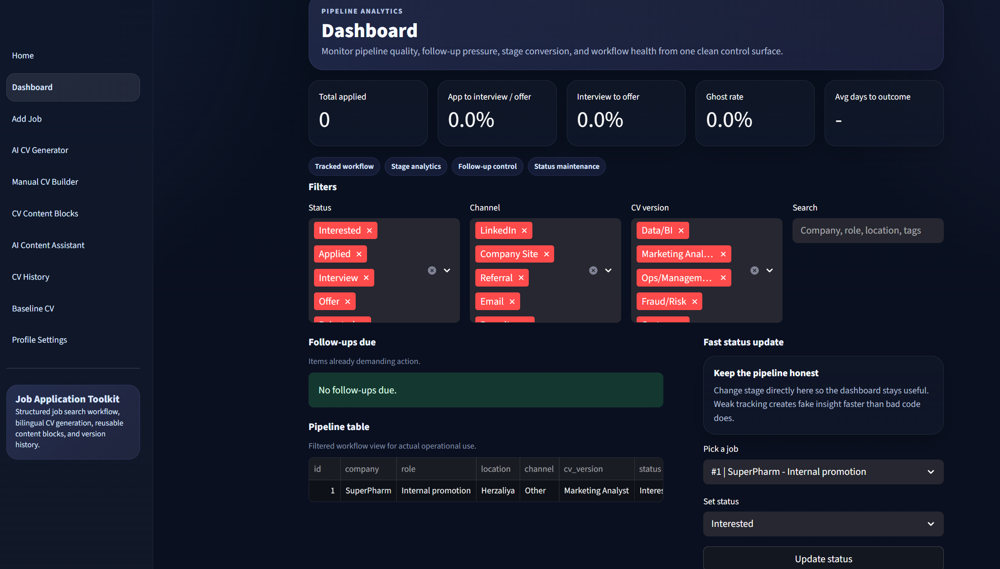
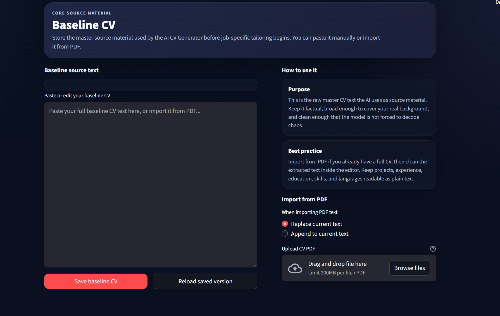
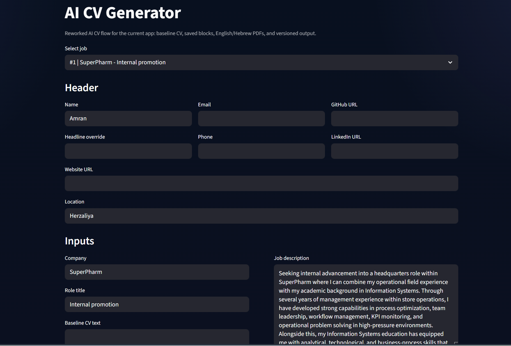
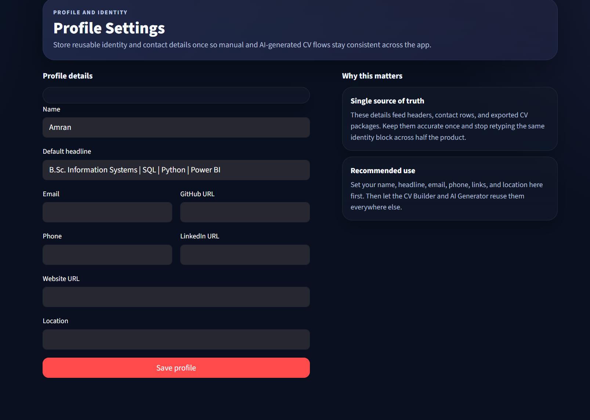

# Job Application Toolkit

An AI-powered job application platform built to make CV tailoring, job tracking, and document generation faster, cleaner, and more organized.

## Overview

This project was created to solve a common problem: applying for jobs usually means rewriting the same CV again and again, adjusting details manually, keeping track of versions, and wasting time on repetitive formatting. A deeply inspiring use of human life.

The toolkit turns that process into a structured workflow. Instead of editing documents blindly, the user manages job applications through a system that supports tailored CV creation, AI-assisted adaptation, document history, and export-ready outputs.

## Core Capabilities

- AI-assisted CV tailoring based on job descriptions
- Job-specific CV versioning and history
- Baseline CV management
- Manual CV editing and content block control
- Bilingual CV workflow support
- PDF export for polished application documents
- ATS-aware keyword alignment
- Dashboard-style application tracking
- Streamlit-based interactive interface

## Why This Project Stands Out

This is not just a CV generator. It is a workflow system for managing the job application process from one place.

The project combines:
- practical automation
- structured document management
- AI-assisted writing support
- user-friendly interface design
- export-ready outputs for real-world use

It is built for people who want a more efficient and systematic way to prepare strong job applications without losing control over the final result.

## Tech Stack

- Python
- Streamlit
- OpenAI API
- ReportLab
- SQLite

## Project Structure

- jobtracker/ - main application entry and core app files
- jobtracker/pages/ - Streamlit pages for app workflows
- jobtracker/lib/ - utility logic, PDF generation, ATS logic, and database handling
- jobtracker/exports/ - generated CV and cover letter outputs
- ssets/images/ - repository screenshots used in documentation
- docs/ - supporting documentation and screenshot gallery

## Key Screens

### Home Page

### Add Job Flow

### Dashboard

### Baseline CV Builder

### AI CV Workflow

### Profile / User Configuration

More screenshots are available in [jobtracker/docs/screenshots.md](jobtracker/docs/screenshots.md).

## Use Case

A typical workflow looks like this:

1. Add a target job
2. Store or paste the relevant job description
3. Build from a baseline CV or edit manually
4. Use AI to tailor the CV to the role
5. Review and refine content blocks
6. Export professional final documents
7. Keep version history for future applications

## Future Improvements

- richer analytics for application performance
- more advanced ATS scoring and recommendations
- stronger document comparison tools
- improved multilingual workflows
- enhanced UI polish and navigation

## Author

**Amran**  
Information Systems graduate focused on building practical systems that combine automation, structure, and usable design.
