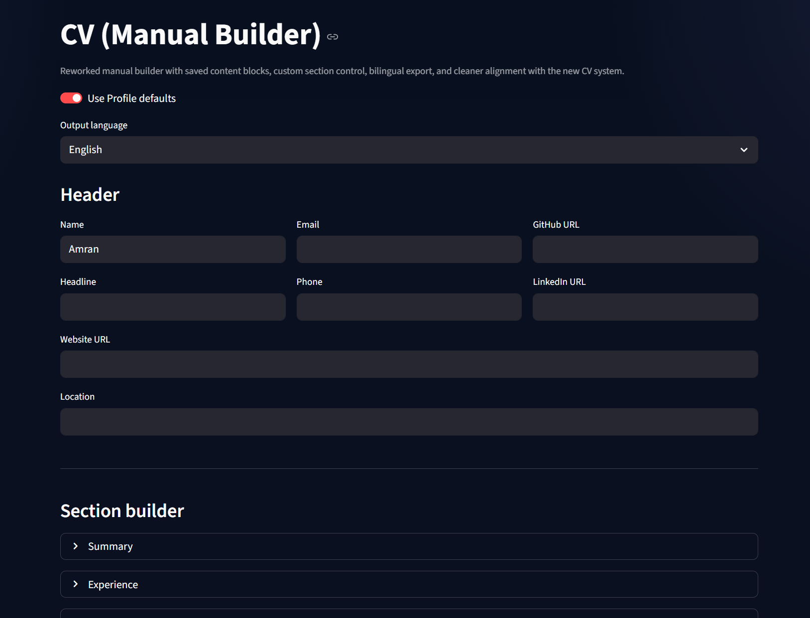
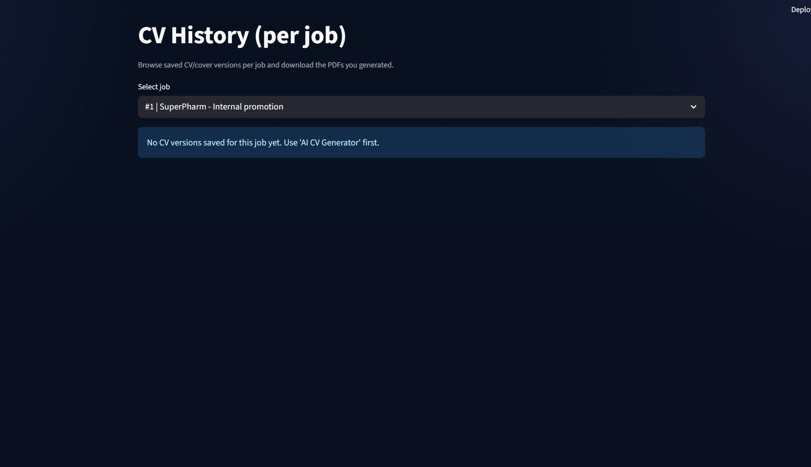
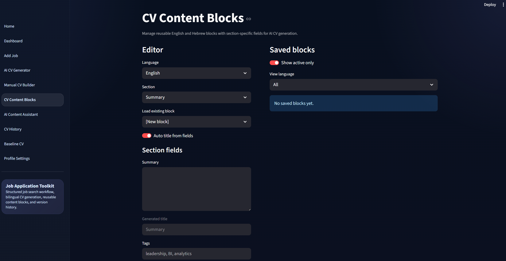
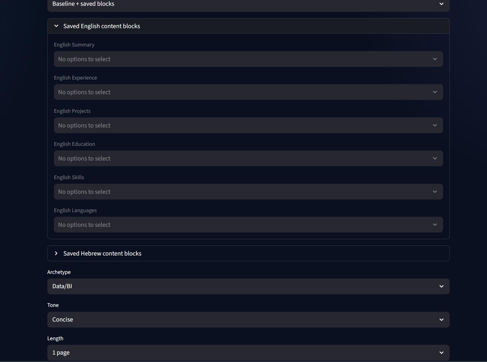
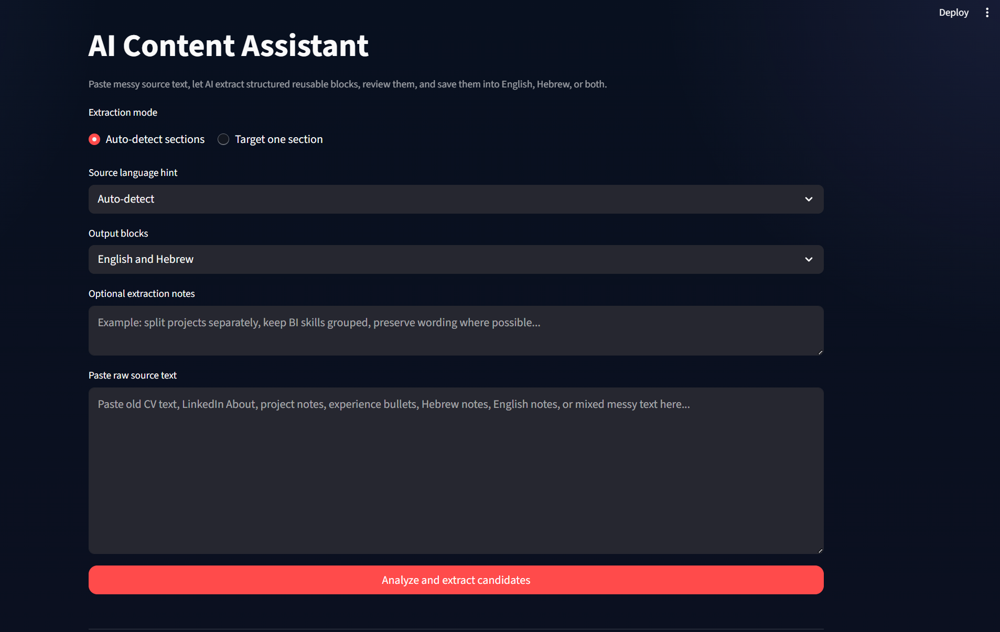

# Screenshot Gallery

This gallery shows the main screens and workflows of the Job Application Toolkit.

## Main Pages

### Home Page

### Add Job Page

### Dashboard

### Profile Page

## CV Management

### Baseline CV

### Manual CV Editing

### CV History

### Content Blocks

## AI Workflow

### AI CV Generation - View 1

### AI CV Generation - View 2

### AI Assistant

